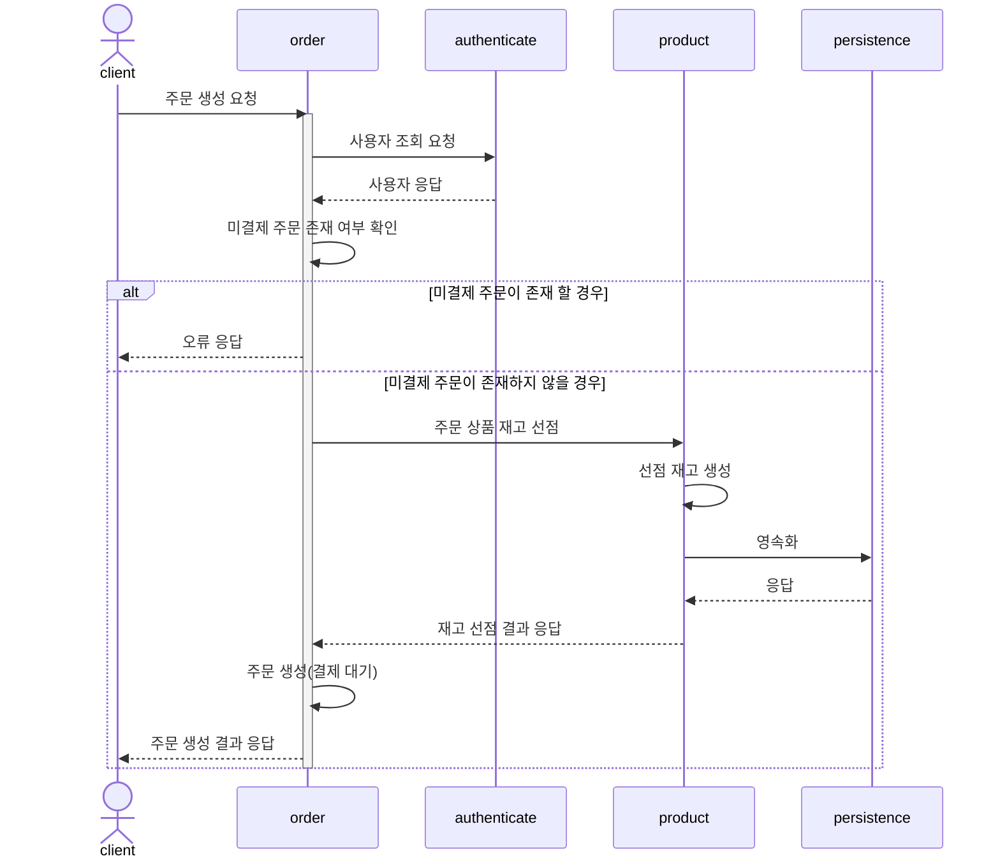

```mermaid
sequenceDiagram
    actor client
    participant order
    participant authenticate
    participant product
    participant persistence
    client ->> order: 주문 생성 요청
    activate order
    order ->> authenticate: 사용자 조회 요청
    authenticate -->> order: 사용자 응답
    order ->> order: 미결제 주문 존재 여부 확인
    alt 미결제 주문이 존재 할 경우
    order -->> client: 오류 응답
    else 미결제 주문이 존재하지 않을 경우
    order ->> product: 주문 상품 재고 선점
    product ->> product: 선점 재고 생성
    product ->> persistence: 영속화
    persistence -->> product: 응답
    product -->> order: 재고 선점 결과 응답
    order ->> order: 주문 생성(결제 대기)
    order -->> client: 주문 생성 결과 응답
    end
    deactivate order
```