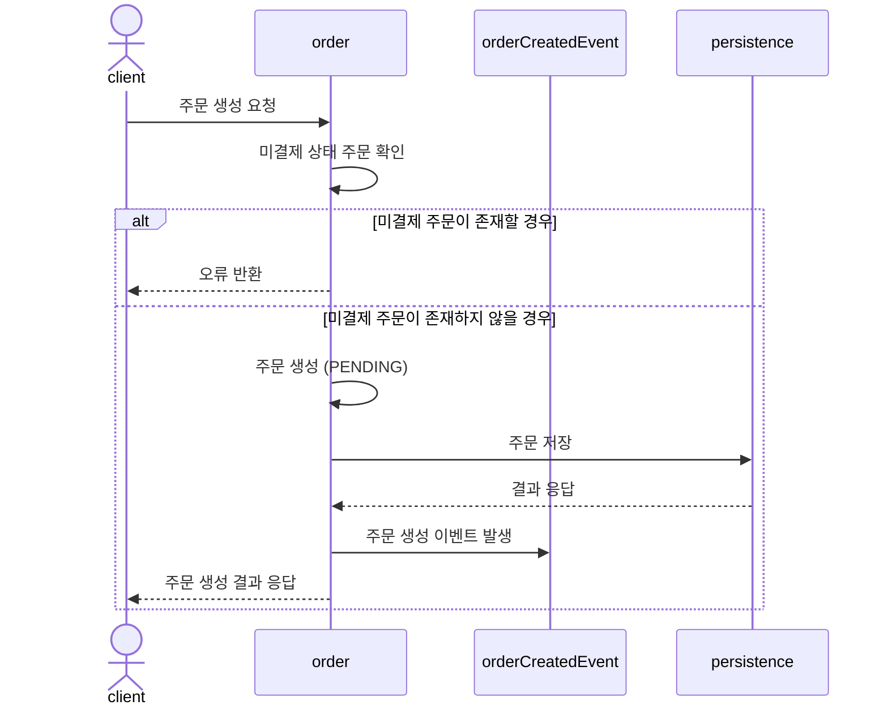

```mermaid
sequenceDiagram
    actor client
    participant order
    participant orderCreatedEvent
    participant persistence
    client ->> order: 주문 생성 요청
    order ->> order: 미결제 상태 주문 확인
    alt 미결제 주문이 존재할 경우
    order -->> client: 오류 반환
    else 미결제 주문이 존재하지 않을 경우
    order ->> order: 주문 생성 (PENDING)
    order ->> persistence: 주문 저장
    persistence -->> order: 결과 응답
    order ->> orderCreatedEvent: 주문 생성 이벤트 발생
    order -->> client: 주문 생성 결과 응답
    end
```
