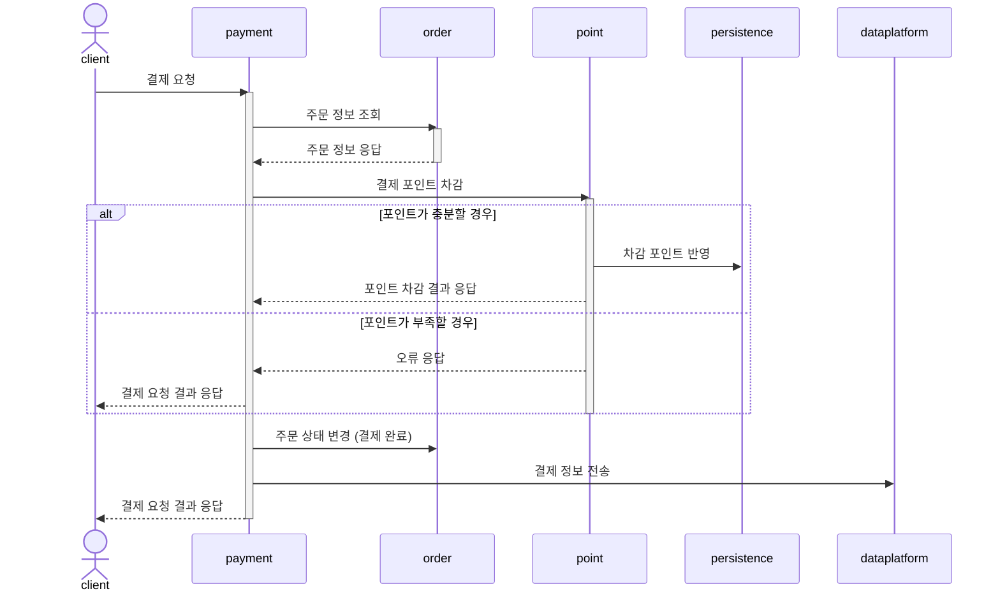

```mermaid
sequenceDiagram
    actor client
    participant payment
    participant order
    participant point
    participant persistence
    participant dataplatform
    client ->> payment: 결제 요청
    activate payment
    payment ->> order: 주문 정보 조회
    activate order
    order -->> payment: 주문 정보 응답
    deactivate order
    payment ->> point: 결제 포인트 차감
    activate point
    alt 포인트가 충분할 경우
    point ->> persistence: 차감 포인트 반영
    point -->> payment: 포인트 차감 결과 응답
    else 포인트가 부족할 경우
    point -->> payment: 오류 응답
    payment -->> client: 결제 요청 결과 응답
    end
    deactivate point
    payment ->> order: 주문 상태 변경 (결제 완료)
    payment ->> dataplatform: 결제 정보 전송
    payment -->> client: 결제 요청 결과 응답
    deactivate payment
```
